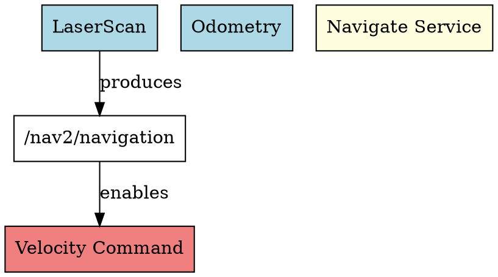

# ROS 系统能力地图构建方案

> **目标**：通过 ZeroClaw 对 ROS 系统能力进行分析和挖掘，构建系统能力地图，建立动作能力因果关联，实现有目的的动作执行

> **版本**：v1.0 - 初始版本

---

## 一、需求分析

### 1.1 核心需求

| 需求 | 描述 | 优先级 |
|------|------|--------|
| **能力发现** | 发现系统可提供的信息、可操作的话题、可实现的动作 | P0 |
| **能力分类** | 将能力分为感知、决策、执行三类 | P0 |
| **因果关联** | 建立动作之间的因果关系（前置条件 → 动作 → 效果） | P0 |
| **目标规划** | 根据目标自动分解动作序列 | P1 |
| **能力查询** | 支持按类型、能力名称、节点查询 | P1 |

### 1.2 能力分类体系

```
┌─────────────────────────────────────────────────────────────┐
│                    系统能力地图                               │
├─────────────────────────────────────────────────────────────┤
│  ┌─────────────┐  ┌─────────────┐  ┌─────────────┐        │
│  │   感知能力   │  │   决策能力   │  │   执行能力   │        │
│  │ (Sensing)  │  │ (Decision)  │  │ (Actuation) │        │
│  └──────┬──────┘  └──────┬──────┘  └──────┬──────┘        │
│         │                 │                 │               │
│  - 传感器数据      │  - 服务调用        │  - 动作执行     │
│  - 状态反馈        │  - 行为选择        │  - 运动控制     │
│  - 环境信息        │  - 路径规划        │  - 抓取操作     │
│                   │                   │                  │
│                   └───────┬───────────┘                  │
│                           │                              │
│                           ▼                              │
│                   ┌───────────────┐                      │
│                   │  因果关系图    │                      │
│                   │ (Causal Graph)│                      │
│                   └───────────────┘                      │
└─────────────────────────────────────────────────────────────┘
```

---

## 二、系统架构

### 2.1 模块结构

```
src/capability_map/
├── mod.rs              # 模块导出
├── graph.rs            # 能力图结构
├── classifier.rs       # 能力分类器
├── causal.rs          # 因果关系构建
├── planner.rs          # 动作规划器
└── registry.rs        # 能力注册表
```

### 2.2 核心数据结构

```rust
// 能力节点
pub struct CapabilityNode {
    pub id: String,
    pub name: String,
    pub category: CapabilityCategory,
    pub ros_type: RosCapabilityType,
    pub node: String,           # 提供该能力的节点
    pub description: String,
    pub preconditions: Vec<Condition>,   # 前置条件
    pub effects: Vec<Effect>,           # 执行效果
}

// 因果边
pub struct CausalEdge {
    pub from: String,           # 原因节点ID
    pub to: String,             # 结果节点ID
    pub relation: CausalRelation,
    pub probability: f32,       # 因果置信度
}

// 能力地图
pub struct CapabilityMap {
    pub nodes: HashMap<String, CapabilityNode>,
    pub edges: Vec<CausalEdge>,
    pub topics: HashMap<String, TopicCapability>,
    pub services: HashMap<String, ServiceCapability>,
    pub actions: HashMap<String, ActionCapability>,
}
```

---

## 三、迭代计划

### Iteration 1: 能力地图基础结构

**目标**：建立能力地图核心数据结构

| 任务 | 文件 | 描述 |
|------|------|------|
| T1.1 | `src/capability_map/graph.rs` | 创建 CapabilityNode, CausalEdge, CapabilityMap 结构 |
| T1.2 | `src/capability_map/graph.rs` | 实现节点添加、删除、查询 API |
| T1.3 | `src/capability_map/graph.rs` | 实现图的序列化和反序列化 |
| T1.4 | `src/capability_map/mod.rs` | 创建模块入口 |

**验收标准**：
- [ ] CapabilityMap 可以存储节点和边
- [ ] 支持 JSON 序列化/反序列化
- [ ] 单元测试覆盖核心功能

### Iteration 2: 能力分类

**目标**：将 ROS 元素分类为感知/决策/执行能力

| 任务 | 文件 | 描述 |
|------|------|------|
| T2.1 | `src/capability_map/classifier.rs` | 创建 CapabilityCategory 枚举 |
| T2.2 | `src/capability_map/classifier.rs` | 实现话题类型分类器 |
| T2.3 | `src/capability_map/classifier.rs` | 实现服务类型分类器 |
| T2.4 | `src/capability_map/classifier.rs` | 实现动作类型分类器 |
| T2.5 | `src/capability_map/classifier.rs` | 从 RosSnapshot 自动构建能力地图 |

**能力分类规则**：

```rust
enum CapabilityCategory {
    Sensing,    // 感知 - 传感器数据、环境信息
    Decision,    // 决策 - 服务、行为选择
    Actuation,   // 执行 - 动作、 topic发布控制
}

// 分类启发式规则：
// - 话题以 /sensor_*, /camera, /laser, /imu 开头 -> Sensing
// - 话题以 /cmd_*, /set_*, /move_ 开头 -> Actuation
// - 服务以 /compute_, /plan_, /decide_ 开头 -> Decision
// - Action server -> Actuation
```

**验收标准**：
- [ ] 自动从 RosSnapshot 分类能力
- [ ] 分类准确率 > 80%（基于启发式规则）
- [ ] 单元测试覆盖

### Iteration 3: 因果关系构建

**目标**：建立动作能力之间的因果关联

| 任务 | 文件 | 描述 |
|------|------|------|
| T3.1 | `src/capability_map/causal.rs` | 定义 CausalRelation 枚举 |
| T3.2 | `src/capability_map/causal.rs` | 实现基于话题的因果边推断 |
| T3.3 | `src/capability_map/causal.rs` | 实现基于服务调用的因果边推断 |
| T3.4 | `src/capability_map/causal.rs` | 实现基于动作的因果边推断 |
| T3.5 | `src/capability_map/causal.rs` | 构建完整因果关系图 |

**因果关系类型**：

```rust
enum CausalRelation {
    Enables,         // 使能 - A 使能 B
    Produces,        // 产生 - A 产生 B (数据流)
    Consumes,        // 消耗 - A 消耗 B
    Conflicts,       // 冲突 - A 与 B 冲突
    Triggers,        // 触发 - A 触发 B
}
```

**因果推断规则**：
1. **话题因果**：如果节点 A 发布话题 T，节点 B 订阅话题 T，则 A → B (Produces → Consumes)
2. **服务因果**：如果服务 S 的输入类型与话题 T 的消息类型匹配，则 S → T
3. **动作因果**：Action Goal → Action Result

**验收标准**：
- [ ] 从运行时数据自动推断因果关系
- [ ] 因果图支持查询（给定动作，找出所有可达状态）
- [ ] 单元测试覆盖

### Iteration 4: 目标动作规划

**目标**：根据目标自动规划动作序列

| 任务 | 文件 | 描述 |
|------|------|------|
| T4.1 | `src/capability_map/planner.rs` | 定义 Goal 和 ActionPlan 结构 |
| T4.2 | `src/capability_map/planner.rs` | 实现 BFS 动作规划算法 |
| T4.3 | `src/capability_map/planner.rs` | 实现 A* 动作规划算法 |
| T4.4 | `src/capability_map/planner.rs` | 实现目标验证器 |
| T4.5 | `src/capability_map/planner.rs` | 添加规划结果缓存 |

**规划算法**：

```rust
pub struct ActionPlanner {
    capability_map: CapabilityMap,
    max_depth: usize,
}

impl ActionPlanner {
    pub fn plan(&self, goal: &Goal) -> Result<ActionPlan, PlanError> {
        // 1. 从因果图中找到满足目标的效果节点
        // 2. 反向追溯到可执行的起始动作
        // 3. 返回动作序列
    }
}
```

**验收标准**：
- [ ] 给定目标返回动作序列
- [ ] 规划深度不超过 10 步
- [ ] 支持缓存优化

### Iteration 5: 能力注册与查询

**目标**：提供能力注册和查询 API

| 任务 | 文件 | 描述 |
|------|------|------|
| T5.1 | `src/capability_map/registry.rs` | 创建 CapabilityRegistry 结构 |
| T5.2 | `src/capability_map/registry.rs` | 实现按类型查询 |
| T5.3 | `src/capability_map/registry.rs` | 实现按节点查询 |
| T5.4 | `src/capability_map/registry.rs` | 实现按关键字查询 |
| T5.5 | `src/main.rs` | 添加 `capability map` CLI 子命令 |

**CLI 命令**：

```bash
# 查看能力地图概览
zeroinsect capability map

# 按类别查看
zeroinsect capability map --category sensing
zeroinsect capability map --category actuation

# 查询特定节点的能力
zeroinsect capability map --node /nav2/navigation

# 规划动作序列
zeroinsect capability plan --goal "move to kitchen"

# 查看因果关系
zeroinsect capability graph --from /cmd_vel
```

**验收标准**：
- [ ] CLI 命令可执行
- [ ] 支持多种查询方式
- [ ] 输出格式美观

---

## 四、数据流设计

### 4.1 能力发现流程

```
┌─────────────────────────────────────────────────────────────┐
│                    能力发现流程                               │
├─────────────────────────────────────────────────────────────┤
│                                                              │
│  1. 运行时自省                                               │
│     ┌─────────────────────────────────────┐                │
│     │  RosRuntimeIntrospector            │                │
│     │  - list_nodes()                    │                │
│     │  - list_topics()                   │                │
│     │  - list_services()                 │                │
│     │  - list_actions()                  │                │
│     └──────────────┬──────────────────────┘                │
│                    │                                        │
│                    ▼                                        │
│  2. 能力分类                                                  │
│     ┌─────────────────────────────────────┐                │
│     │  CapabilityClassifier               │                │
│     │  - classify_topic()                │                │
│     │  - classify_service()              │                │
│     │  - classify_action()               │                │
│     └──────────────┬──────────────────────┘                │
│                    │                                        │
│                    ▼                                        │
│  3. 因果构建                                                  │
│     ┌─────────────────────────────────────┐                │
│     │  CausalGraphBuilder                 │                │
│     │  - infer_topic_edges()              │                │
│     │  - infer_service_edges()            │                │
│     │  - infer_action_edges()             │                │
│     └──────────────┬──────────────────────┘                │
│                    │                                        │
│                    ▼                                        │
│  4. 能力地图输出                                             │
│     ┌─────────────────────────────────────┐                │
│     │  CapabilityMap                      │                │
│     │  - nodes: HashMap                   │                │
│     │  - edges: Vec                      │                │
│     │  - to_json()                       │                │
│     └─────────────────────────────────────┘                │
│                                                              │
└─────────────────────────────────────────────────────────────┘
```

### 4.2 动作规划流程

```
┌─────────────────────────────────────────────────────────────┐
│                    动作规划流程                               │
├─────────────────────────────────────────────────────────────┤
│                                                              │
│  用户输入: "让机器人移动到厨房"                                │
│                                                              │
│  1. 目标解析                                                 │
│     ┌─────────────────────────────────────┐                │
│     │  GoalParser                         │                │
│     │  "移动到厨房" → LocationGoal        │                │
│     └──────────────┬──────────────────────┘                │
│                    │                                        │
│                    ▼                                        │
│  2. 目标分解                                                 │
│     ┌─────────────────────────────────────┐                │
│     │  GoalDecomposer                     │                │
│     │  LocationGoal → [                   │                │
│     │    - 定位当前位置                    │                │
│     │    - 规划路径                        │                │
│     │    - 执行移动                        │                │
│     │  ]                                  │                │
│     └──────────────┬──────────────────────┘                │
│                    │                                        │
│                    ▼                                        │
│  3. 动作搜索 (在因果图中)                                     │
│     ┌─────────────────────────────────────┐                │
│     │  ActionPlanner (A*)                 │                │
│     │  - current_state → goal_state       │                │
│     │  - 搜索因果边                        │                │
│     │  - 返回动作序列                      │                │
│     └──────────────┬──────────────────────┘                │
│                    │                                        │
│                    ▼                                        │
│  4. 计划输出                                                 │
│     ┌─────────────────────────────────────┐                │
│     │  ActionPlan                         │                │
│     │  [                                  │                │
│     │    { action: "call_localization",   │                │
│     │      params: {...} },              │                │
│     │    { action: "call_navigate",       │                │
│     │      params: {...} },              │                │
│     │  ]                                  │                │
│     └─────────────────────────────────────┘                │
│                                                              │
└─────────────────────────────────────────────────────────────┘
```

---

## 五、与现有模块集成

### 5.1 依赖关系

```
┌─────────────────────────────────────────────────────────────┐
│                    模块依赖关系                               │
├─────────────────────────────────────────────────────────────┤
│                                                              │
│   introspect (已有)                                         │
│       │                                                     │
│       ├── RosSnapshot ──────┐                              │
│       │                     │                              │
│       │                     ▼                              │
│       │              capability_map (新增)                  │
│       │                     │                              │
│       │         ┌───────────┼───────────┐                  │
│       │         │           │           │                  │
│       │         ▼           ▼           ▼                  │
│       │    classifier   causal      planner                 │
│       │         │           │           │                  │
│       │         └───────────┼───────────┘                  │
│       │                     │                              │
│       ▼                     ▼                              │
│   tools (已有)                                               │
│       │                                                     │
│       └── RobotTool ◄──────────────┐                       │
│                                     │                      │
│   bridge (已有)                     │                      │
│       │                        能力执行                     │
│       ▼                                                     │
│   ZeroClaw ◄──────────────────────────────────────────────┘
│                                                              │
└─────────────────────────────────────────────────────────────┘
```

### 5.2 API 对接

```rust
// 从 RosSnapshot 构建能力地图
use crate::introspect::runtime::RosRuntimeIntrospector;
use crate::capability_map::{CapabilityMap, CapabilityClassifier};

let mut introspector = RosRuntimeIntrospector::new();
let snapshot = introspector.capture_snapshot().unwrap();

let classifier = CapabilityClassifier::new();
let capability_map = classifier.classify(&snapshot);

// 从能力地图规划动作
use crate::capability_map::{ActionPlanner, Goal};

let planner = ActionPlanner::new(&capability_map);
let goal = Goal::from_string("move to kitchen");
let plan = planner.plan(&goal).unwrap();

for action in plan.actions {
    println!("Execute: {}", action.name);
}
```

---

## 六、输出文件

### 6.1 能力地图 JSON

```json
{
  "version": "1.0",
  "timestamp": 1708500000,
  "nodes": [
    {
      "id": "node:/robot/robot_state_publisher",
      "name": "robot_state_publisher",
      "category": "sensing",
      "ros_type": "node",
      "description": "Publishes robot state",
      "preconditions": [],
      "effects": [
        { "topic": "/joint_states", "type": "produces" },
        { "topic": "/tf", "type": "produces" }
      ]
    }
  ],
  "edges": [
    {
      "from": "topic:/scan",
      "to": "node:/nav2/slam_toolbox",
      "relation": "produces_consumes",
      "probability": 1.0
    }
  ]
}
```

### 6.2 因果图 DOT



---

## 七、测试计划

### 7.1 单元测试

| 模块 | 测试用例 |
|------|----------|
| graph | 节点添加/删除、序列化、循环检测 |
| classifier | 话题分类、服务分类、动作分类 |
| causal | 话题因果推断、服务因果推断 |
| planner | BFS 规划、A* 规划、缓存命中 |
| registry | 按类型查询、按节点查询 |

### 7.2 集成测试

| 测试场景 | 预期结果 |
|----------|----------|
| 从真实 ROS2 系统构建能力地图 | 成功构建，包含所有节点和边 |
| 规划"移动到目标点" | 返回导航相关动作序列 |
| 查询所有执行类能力 | 返回 cmd_vel, gripper 等 |

---

## 八、风险与挑战

| 风险 | 影响 | 缓解措施 |
|------|------|----------|
| 因果推断准确率不足 | 规划可能失败 | 提供手动标注接口 |
| 规划复杂度爆炸 | 规划超时 | 限制搜索深度，使用启发式 |
| ROS2 运行时不可用 | 无法获取实时数据 | 支持从缓存加载 + 静态分析 |

---

## 九、里程碑

| 里程碑 | 预计时间 | 交付物 |
|--------|----------|--------|
| M1: 基础结构 | 1 天 | CapabilityMap 数据结构 |
| M2: 能力分类 | 1 天 | 自动分类器 |
| M3: 因果图 | 2 天 | 因果边推断 |
| M4: 动作规划 | 2 天 | 规划器 + CLI |
| M5: 集成测试 | 1 天 | 端到端测试 |

**总工期**：约 7 天

---

## 十、后续扩展

1. **语义理解**：集成大语言模型理解自然语言目标
2. **学习增强**：从执行反馈中学习因果关系权重
3. **多机器人**：扩展到多机器人协作场景
4. **可视化**：Web 界面展示能力地图
